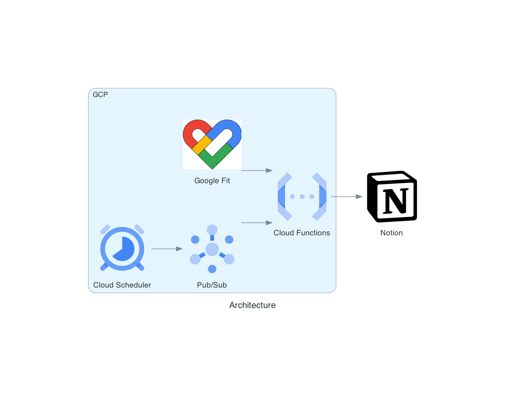

# Google Fit Notion Integration

GoogleFitNotionIntegrationは、Google Fitから取得した運動・バイタルデータと天候データをNotionデータベースに自動記録するシステムです。
Google Cloud Functions/Run、Firestore、Notion API、気象庁データスクレイピングを活用し、健康管理を効率化します。

## アーキテクチャ


## 取得可能なデータ

### Google Fitデータ
以下のデータはGoogle Fitで収集されている場合に取得可能です。Apple HealthからGoogle Fitへの連携設定や、各種測定アプリの利用が前提となります。

#### アクティビティデータ
- 移動距離 (km) - iPhone本体やApple Watchのワークアウトアプリなどで記録
- 歩数 (歩) - iPhone本体やApple Watchで自動記録
- 消費カロリー (kcal) - iPhone本体やApple Watchで自動記録
- 強めの運動時間 (分) - Apple Watchのワークアウトアプリなどで記録

#### バイタルデータ
- 平均心拍数 (bpm) - Apple WatchとHeartWatchなどの専用アプリが必要
- 酸素飽和度 (%) - Apple WatchとHeartWatchなどの専用アプリが必要
- 体重 (kg) - スマート体重計と専用アプリが必要

#### 睡眠データ
- 睡眠時間 (分) - 睡眠追跡アプリが必要

**注意**: データが取得できるかどうかは、使用しているデバイス、アプリ、およびApple HealthからGoogle Fitへの連携設定に依存します。すべてのデータがすべてのユーザーで利用できるとは限りません。

### 天気データ
Google Maps Platform Weather APIを使用して、指定された位置情報の天気データを取得します。以下のデータが含まれます：

- 天気 - 朝（6-12時）、昼（12-18時）、夜（18-24時）の各時間帯の天気状況
- 気温 - 各時間帯の平均気温
- 湿度 - 各時間帯の平均湿度
- 降水量 - 各時間帯の総降水量
- 気圧 - 各時間帯の平均気圧
- 日照時間 - 日の出から日の入りまでの時間（分）

各時間帯のデータは「朝：晴れ、昼：曇り、夜：雨」のようにフォーマットされます。

## Notionデータベースの設定
このシステムを使用するには、Notionデータベースに特定のプロパティを設定する必要があります。以下のプロパティ名を正確に設定してください：

| プロパティ名 | タイプ | 説明 |
|------------|------|-----|
| 日付 | 日付 | データの日付（必須） |
| 移動距離 (km) | 数値 | その日の移動距離 |
| 歩数 (歩) | 数値 | その日の歩数 |
| 消費カロリー (kcal) | 数値 | その日の消費カロリー |
| 強めの運動 (分) | 数値 | 強度の高い運動の時間 |
| 平均心拍数 (bpm) | 数値 | その日の平均心拍数 |
| 酸素飽和度 (%) | 数値 | その日の平均酸素飽和度 |
| 体重 (kg) | 数値 | その日の体重 |
| 睡眠時間 (分) | 数値 | その日の睡眠時間 |
| 天気 | テキスト | 朝・昼・夜の天気状況 |
| 気温 | テキスト | 朝・昼・夜の平均気温 |
| 湿度 | テキスト | 朝・昼・夜の平均湿度 |
| 降水量 | テキスト | 朝・昼・夜の降水量 |
| 気圧 | テキスト | 朝・昼・夜の平均気圧 |
| 日照時間 | テキスト | 日の出から日の入りまでの時間（分） |
| 振り返り | チェックボックス | データ更新をスキップ |

**重要**: プロパティ名は上記と完全に一致している必要があります。特に単位の表記（括弧と単位）まで同じにしてください。

### Notionテンプレート

日記やヘルスデータの記録には、Notionの習慣トラッカーテンプレートを活用すると便利です。以下のリンクから様々な習慣トラッカーテンプレートを入手できます：

[Notion公式：習慣トラッカーテンプレート集](https://www.notion.com/ja/templates/category/habit-tracking)

これらのテンプレートを使用して、Google Fitからのデータを記録するための日記ページを作成し、健康習慣の可視化と継続をサポートすることができます。

## プロジェクト構成
```
.
├── src/
│   ├── main.py          # Google Fitデータ・Notion連携本体
│   ├── util.py          # Google Fit/Notionユーティリティ
│   ├── constants.py     # 定数定義
│   ├── trigger_date.py  # 日付指定バッチトリガー
│   ├── batch_process.sh # バッチ処理用シェル
│   ├── weather/
│   │   ├── weather_notion.py # 天気データ取得・Notion更新
│   │   ├── update_weather.py # 天気データ取得・保存
│   │   └── __init__.py
│   └── github/
│       ├── github_notion.py # GitHub活動データ・Notion更新
│       └── __init__.py
├── scripts/
│   └── utils/
│       ├── auth.py      # Google認証・Firestore保存（これ一本でOK）
│       ├── audit_credentials.py # 認証情報監査
│       ├── rotate_credentials.py # 認証ローテーション
│       ├── deploy.sh   # Cloud Functionsデプロイ
│       ├── trigger_fit.sh # PubSubトリガ
│       ├── update_weather.sh # 天候データ更新
│       ├── update_github.sh # GitHub活動データ更新
│       └── setup.sh    # 初期セットアップ
├── docs/
│   ├── architecture.png
│   └── ...
├── .env.example
├── .env
└── LICENSE
```

## セットアップ手順

### 1. Notionインテグレーション・データベース作成
- Notionでインテグレーションを作成し、シークレットトークンを取得
- データベースを作成し、インテグレーションと共有
- 上記のプロパティを正確に作成

### 2. 環境変数の設定
`.env.example`をコピーして`.env`を作成し、必要な値を入力

### 3. Google認証・Firestore保存
**これ一本でOK！**
```bash
python scripts/utils/auth.py
```
```fish
python scripts/utils/auth.py
```
- ブラウザ認証後、自動でFirestoreに認証情報が保存されます

### 4. Cloud Functions/Runデプロイ
```bash
./scripts/utils/deploy.sh
```
```fish
./scripts/utils/deploy.sh
```

### 5. バイタル・運動データのNotion連携を手動トリガ
```bash
./scripts/utils/trigger_fit.sh 2025-04-20
```
```fish
./scripts/utils/trigger_fit.sh 2025-04-20
```
- 日付省略で当日分

### 6. 天候データのNotion連携
```bash
./scripts/utils/update_weather.sh 2025-06-14 2025-06-21
```
```fish
./scripts/utils/update_weather.sh 2025-04-20
```
- 日付省略で2日前分

### 7. GitHub活動データのNotion連携
```bash
./scripts/utils/update_github.sh 20250420
```
```fish
./scripts/utils/update_github.sh 20250420
```
- 日付省略で昨日分
- 日付形式はYYYYMMDD（ハイフンなし）

### 8. 自動定期実行（GitHub Actions）
毎日JST 24:30に前日のGitHub活動データを自動同期

**セットアップ:**
1. Repository Secretsの設定:
   - `NOTION_SECRET`: Notion Integration トークン
   - `DATABASE_ID`: Notion データベース ID
2. 失敗時メール通知設定（GitHub Settings → Notifications）

**手動実行:**
- GitHub Actions タブから任意の日付を指定して実行可能
- 詳細は `docs/GitHubActionsSetup.md` を参照

### 9. バッチ処理（例：複数日まとめて）
```bash
# バイタル・天候データを両方処理（デフォルト）
bash src/batch_process.sh 2025-04-01 2025-04-10

# バイタルデータのみ処理
bash src/batch_process.sh --fit-only 2025-04-01 2025-04-10

# 天候データのみ処理
bash src/batch_process.sh --weather-only 2025-04-01 2025-04-10

# 並列処理数を指定
bash src/batch_process.sh -p 5 2025-04-01 2025-04-10
```
```fish
# バイタル・天候データを両方処理（デフォルト）
bash src/batch_process.sh 2025-04-01 2025-04-10

# バイタルデータのみ処理
bash src/batch_process.sh --fit-only 2025-04-01 2025-04-10

# 天候データのみ処理
bash src/batch_process.sh --weather-only 2025-04-01 2025-04-10

# 並列処理数を指定
bash src/batch_process.sh -p 5 2025-04-01 2025-04-10
```

## セキュリティ・運用
- 認証情報はFirestoreで一元管理
- 認証情報の監査: `python scripts/utils/audit_credentials.py`
- トークンローテーション: `python scripts/utils/rotate_credentials.py`
- 3ヶ月ごとにローテーション推奨

## トラブルシューティング
- Notionデータベースのプロパティ名・権限を再確認
- GCP Cloud Functions/Runのログでエラー詳細確認
- 認証情報の有効期限切れ時は`auth.py`で再認証

## ライセンス
MIT
